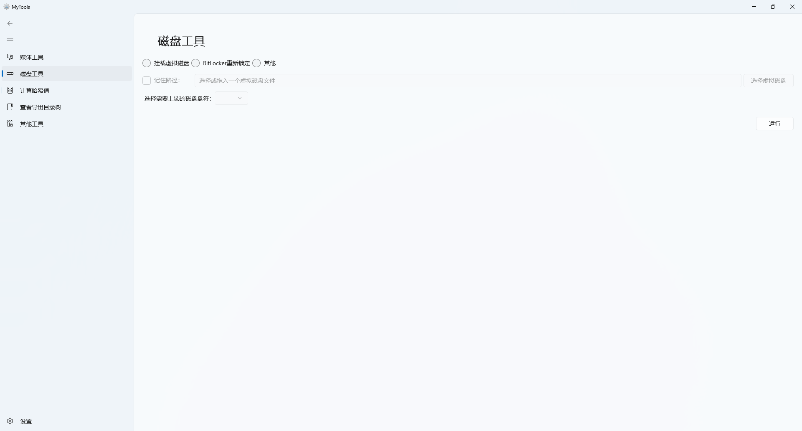
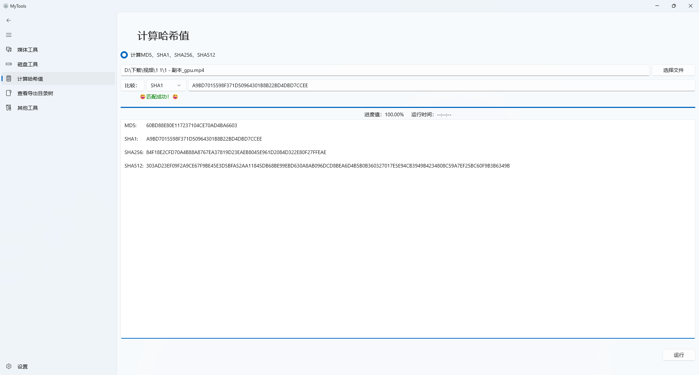
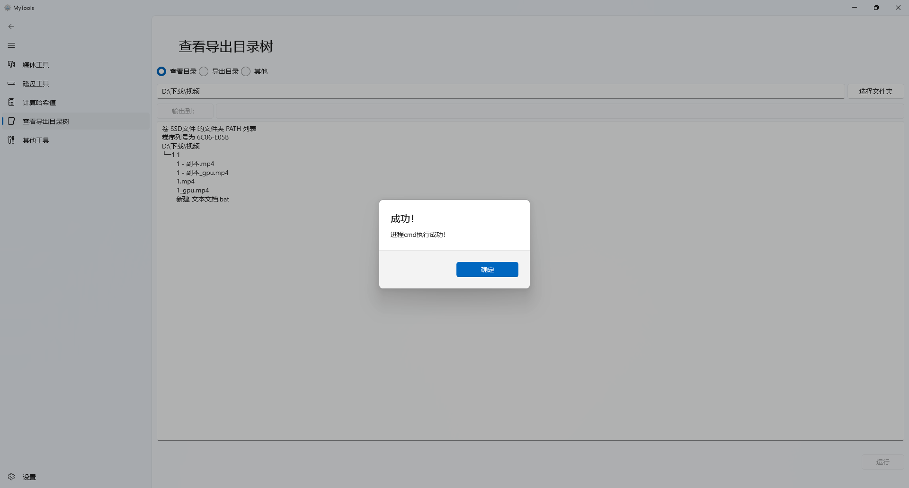
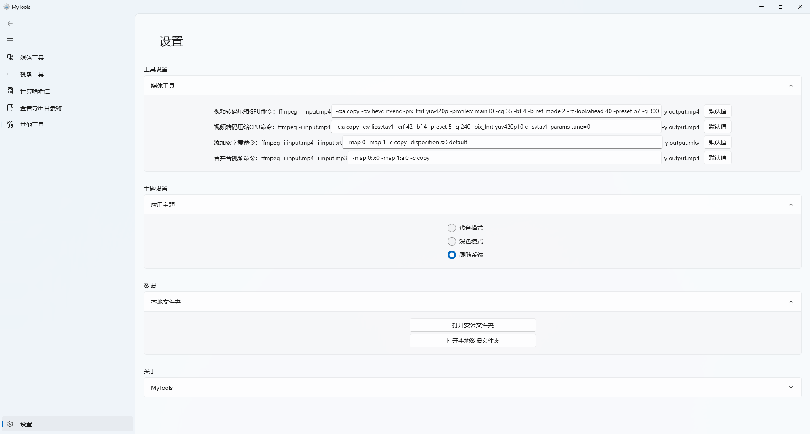

# MyTools

 

# 目录
- [MyTools](#MyTools)
- [概述](#概述)
	- [媒体工具](#媒体工具)
	- [磁盘工具](#磁盘工具)
	- [计算哈希值](#计算哈希值)
	- [查看导出目录树](#查看导出目录树)
	- [其他工具](#其他工具)
	- [设置界面](#设置界面)
- [安装](#安装)
	- [系统要求](#系统要求)
	- [安装步骤](#安装步骤)
		- [下载安装包](#下载安装包)
		- [方法一（使用脚本安装）](#方法一使用脚本安装)
		- [方法二（手动安装）](#方法二手动安装)
- [免责声明](#免责声明)
- [Star数量统计](#Star数量统计)

# 概述
该应用主要通过调用FFmpeg、CMD、PowerShell等进程进行相关操作，所以其具备的功能通过命令行和批处理程序也可实现，但本人喜欢鼠标点点点，所以学着做了这款应用。非专业人士，应用优化、代码规范等后续慢慢来。   
早前版本的简单演示视频：【B站】https://b23.tv/gDqRK84
## 媒体工具
需ffmpeg（含ffprobe），请到 https://ffmpeg.org 下载并配置到环境变量，具体方法自行搜索。  
预设GPU转码命令：高压缩中质量，速度快，必须是支持hevc硬编码的英伟达显卡（如RTX20,30,40）。     
预设CPU转码命令：高压缩高质量，速度慢。    
视频转码命令可到设置页更改。    

## 磁盘工具
此页功能需以管理员权限运行该应用，挂载虚拟磁盘功能需开启Hyper-V功能。

## 计算哈希值

## 查看导出目录树

## 其他工具

## 设置界面

# 安装
## 系统要求
需Windows 10 Build 17763 及以上，支持 ARM64/x86/x64（0.1.0版本后不再支持ARM64/x86）。
## 安装步骤
### 下载安装包
进入[Release](https://github.com/Nostalgia-WZQ/MyTools/releases)页面，下载压缩包并解压。  
### 方法一（使用脚本安装）
1.打开系统设置，搜索开发者选项，打开`开发人员模式`。滚动到页面底部，展开`PowerShell`，开启`更改执行策略，以允许本地...`选项。（仅首次安装需要此步，首次安装完成后可关闭这两个开关）  
2.应用包解压后，右键单击文件夹中的`install.ps1`脚本，选择`使用 PowerShell运行`，根据提示进行相关操作。  
3.安装完成后可关闭第一步打开的开关。   
4.后续更新或重新安装直接双击后缀为`*.msix`的文件即可。
### 方法二（手动安装）
1.应用包解压后，双击`*.cer`→`安装证书`→`本地计算机`→`将所有证书都放入下列存储`→`浏览`→选择`受信任人`或`受信任的根证书颁发机构`。（仅首次安装需要此步）   
2.双击`*.msix`文件安装。（联网状态下，系统会自动安装依赖，若提示“安装失败...需安装Microsoft.WindowsAppRuntime.1.5.msix”，则可手动到`解压后文件夹\Dependencies\x64|X86|arm64\Microsoft.WindowsAppRuntime.1.5.msix`进行安装。）   
3.后续更新或重新安装直接双击后缀为`*.msix`的文件即可。
# 免责声明
该应用部分功能会对电脑内的文件进行操作，为了确保数据安全，请务必在操作前做好原始文件的备份。在操作过程中若发生文件被覆盖、删除或丢失等意外情况，本软件不承担相关责任。请谨慎操作，保障个人数据安全。
# Star数量统计
